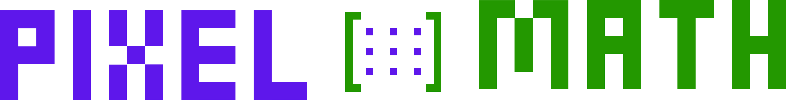

# [PixelMath](#title)

  
  
  
  
  
 

## [Descrição](#project-description)
 PixelMath surgiu de um projeto de faculdade que tinha como objetivo correlacionar Matriz Matemática com Matriz Computacional.

## [Como acessar?] (#acess-project)

Basta entrar no link a seguir: [MathPixel](https://a3cgrafica.vercel.app)

## [Integrantes](#contributors)
<li><a href="https://www.linkedin.com/in/lucasparra2003/"> Lucas Parra</a></li>
<li><a href="https://www.linkedin.com/in/renan-dos-reis-negrão-96b556241/">Renan dos Reis Negrão</a> </li>
<li><a href="https://www.linkedin.com/in/">Rafael Macedo Barbosa</a> </li>
<li><a href="https://www.linkedin.com/in/milenaporto/">Milena Porto Coyado</a> </li>
<li><a href="https://www.linkedin.com/in/">Beatriz Soares</a> </li>

 
